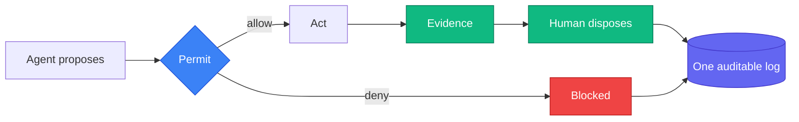

# Dakota Smith

### I build things that build things.

Agentic systems for organizations that can't afford to get it wrong.

---

## The problem I keep working on

Every organization wants agents doing real work. Almost none of them can answer the question that follows: how do you let an agent act without losing the ability to say what happened, why it was allowed, and whether it was correct.

That answer is infrastructure, not prompting. Permission before the act, evidence after it — recorded on one log, replayable rather than asserted. Agents propose, humans dispose, and everything an agent touches leaves a trail you can audit later.

I've built it four different ways, in two languages, to find out which parts hold up.

## Selected work

| Project | What it is | Status |
|---|---|---|
| **[rezidnt](https://github.com/rezidnt/rezidnt)** | A local-first daemon running a fleet of coding agents under policy — permission checked before every action, evidence recorded after, both on one auditable log. Rust. |  |
| **[Dossier](https://github.com/smithdak/dossier)** | Institutional memory an organization owns outright — agents extend it, humans approve, and approved work compounds into the company's own git history. |  |
| **[ObjectCore](https://github.com/smithdak/objectcore)** | A software factory for AI tooling whose output isn't plugins — it's the system that produces and governs them. Live registry, 14 plugins. |  |
| **[Skillsmith](https://github.com/smithdak/skillsmith)** | A compiler and quality gate for agent skills — schema, security, and trigger evals all run before anything ships. |  |

## Writing

[daksmith.dev](https://daksmith.dev/) — orchestration patterns, agent tooling, harness design, and the security model underneath it. Most recently on durable agent orchestration: moving coordination into workflow steps instead of trusting a coordinator agent to hold it together.

## Before this

Shipping enterprise digital platforms since 2012 — Sitecore, Umbraco, Optimizely, .NET, Azure — for organizations where the constraints were real and the rollback plan mattered.

That part is what most AI work is missing.

---

[daksmith.dev](https://daksmith.dev/) · [LinkedIn](https://www.linkedin.com/in/dakota-smith-a855b230)
